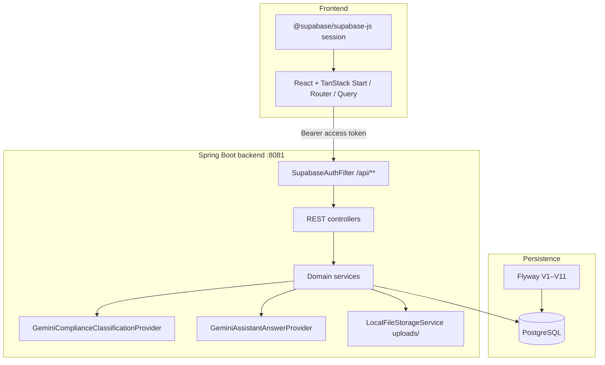
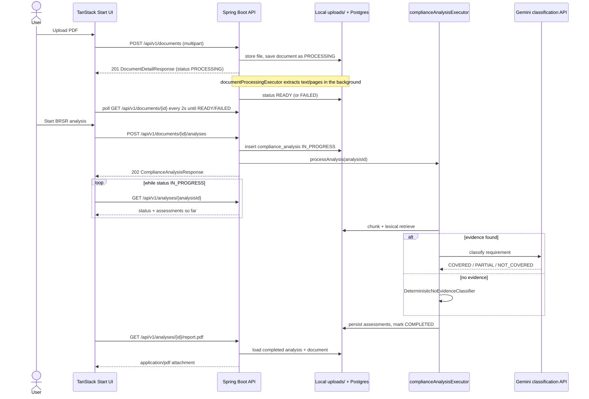
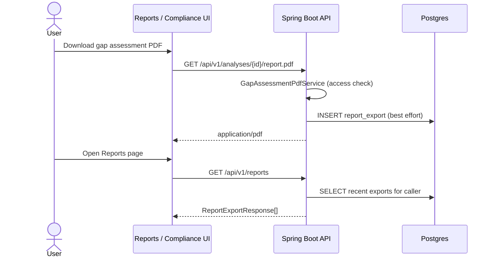

# Architecture

Technical architecture of ESGenius as implemented in this repository. Descriptions below are derived from the source files listed in [VERIFY](#verify).

## Components and request flow

| Layer | Role in code |
| --- | --- |
| **Frontend** | TanStack Start / React Router app (`package.json`, `src/routes/**`). Calls the backend via `apiFetch` helpers in `src/lib/*-api.ts`. Supabase client holds the user session; the access token is sent as `Authorization: Bearer …`. |
| **Auth filter** | `SupabaseAuthFilter` validates tokens against Supabase Auth `GET {url}/auth/v1/user`, caches successes by SHA-256 of the token (`SupabaseTokenValidationCache`, TTL from `SUPABASE_TOKEN_CACHE_TTL`), and sets request attribute `authenticatedUser`. Registered for `/api/*` outside the `test` profile. Skips `OPTIONS` and `GET /api/v1/health`. |
| **API / services** | Controllers under `dev.esgenius.controller` delegate to services. Document-backed flows resolve `Caller` + `DocumentAccessPolicy` (ownership, shared samples, `ADMIN_USER_IDS`). `MeController` exposes usage snapshots; `ReportExportController` lists PDF export history. |
| **Postgres + Flyway** | Runtime datasource is PostgreSQL (`application.yml`). Schema and seed data come from `classpath:db/migration` V1–V11; JPA `ddl-auto: validate`. |
| **Local file storage** | Uploaded PDFs are stored under `app.storage.upload-dir` (default `uploads`) as `{uuid}.pdf` via `LocalFileStorageService`. Metadata and extracted text live in Postgres. |
| **Gemini providers** | Production (`!test`) wires `GeminiComplianceClassificationProvider` and `GeminiAssistantAnswerProvider` when `GEMINI_API_KEY` is set. Test profile replaces both with in-process fakes. |

**Auth identity vs document access:** Supabase supplies `userId` / `email`. `DocumentAccessPolicy` enforces per-document ownership (`document.owner_user_id`), shared samples (`NULL` owner), and admin override (`app.auth.admin-user-ids`). List endpoints filter by org plus visibility; unknown ids for other users’ private uploads yield **404**. Company/framework comparison APIs remain shared seed data without per-user scoping.

**Usage limits:** `UsageLimiter` keeps rolling 24h (uploads, analyses) and 1h (assistant) counters in memory per JVM (`app.limits.*` / `RATE_LIMIT_*` env vars). `GET /api/v1/me` reads remaining per-user budget via `UsageLimiter.snapshot` without consuming it.

**PDF extraction bounds:** `PdfLimitsProperties` (`PDF_MAX_PAGES`, `PDF_MAX_EXTRACTED_CHARS`) reject oversized PDFs during background document processing (the document ends `FAILED` with the limit message).

## Analysis pipeline

Triggered by `POST /api/v1/documents/{documentId}/analyses` → `ComplianceAnalysisService.startAnalysis` → async `ComplianceAnalysisProcessor`.

1. **Create row** — `ComplianceAnalysisCreationService` requires document `READY` with non-blank extracted text, a resolvable framework (`frameworkId` or `frameworkCode`), at least one requirement, and no existing `IN_PROGRESS` analysis for the same document+framework. Status starts as `IN_PROGRESS`.
2. **Dispatch** — `ComplianceAnalysisProcessor` submits work to `complianceAnalysisExecutor` (core 1 / max 2 / queue 8, abort on reject). Rejection or uncaught failure marks the analysis `FAILED`.
3. **Extraction (already done after upload)** — `DocumentProcessingService` + `PdfTextExtractionService` (PDFBox, no OCR) produce full text and `document_page` rows in a background worker (`documentProcessingExecutor`, core 1 / max 2 / queue 8, abort on reject) after the upload request returns. Analysis requires the document to be `READY` and reuses the stored text/pages.
4. **Chunking** — `TextChunkingService.chunkPages` (preferred when pages exist) or legacy `chunk` (~1200–1800 chars, 200 overlap). Page-aware chunks never cross page boundaries.
5. **Lexical retrieval** — `LexicalEvidenceRetrievalService` scores chunks with BM25-inspired / IDF lexical matching, requirement anchor gates, and ESG aliases. Top 3 chunks above score threshold `0.15`. **No embeddings / vector search.**
6. **Classification** (parallel per requirement when evidence exists)
   - **No evidence** → `DeterministicNoEvidenceClassifier` (always `NOT_COVERED`, confidence `0.75`). Gemini is **not** called.
   - **Has evidence** → expand passages → `ComplianceClassificationProvider.classify` (Gemini in production), submitted to `complianceClassificationExecutor` with pool size `GEMINI_MAX_CONCURRENCY` (`app.ai.gemini.max-concurrent-classifications`, 1–8, default 1). On `ComplianceClassificationException`, `ClassificationFailureHandler` returns `HUMAN_REVIEW_REQUIRED` (quota-specific explanation when `QuotaExhaustionScope` is exhausted on the analysis thread).
7. **Async persistence** — each assessment is saved in a new transaction via `ComplianceAnalysisPersistenceService.persistRequirementAssessment`; then `finalizeCompleted` sets analysis `COMPLETED`.
8. **Startup recovery** — `ComplianceAnalysisStartupRecovery` on `ApplicationReadyEvent` marks leftover `IN_PROGRESS` rows `FAILED` with reason *"Analysis was interrupted when the application restarted."*

Inter-request pacing between Gemini classifications uses `app.ai.gemini.inter-request-delay` (default 300 ms).

## Human-review fallback

| Situation | Resulting assessment |
| --- | --- |
| Gemini / classification provider throws | `HUMAN_REVIEW_REQUIRED`, confidence `null`, recommendation to have a human assess; explanation is either the generic failure text or the quota-exhausted text |
| Daily quota already marked exhausted on the analysis thread | Further classify calls fail immediately; failure handler uses the quota explanation |
| No retrieved evidence | **Not** human-review: deterministic `NOT_COVERED` |

Legacy statuses `EVIDENCE_RETRIEVED` / `NO_EVIDENCE_FOUND` remain readable for old rows but must not be persisted by new analyses.

## Where AI is not trusted

- **No-evidence path:** classification is fully deterministic (`DeterministicNoEvidenceClassifier`); model output is never used to invent coverage.
- **Retrieval:** evidence selection is lexical and rule-gated (`LexicalEvidenceRetrievalService`, `RequirementRetrievalRules`), not model-chosen.
- **Assistant empty retrieval:** if no chunks match the question, the API returns a fixed not-found answer with `grounded: false` and does not call Gemini.
- **Failure path:** model/provider errors degrade to `HUMAN_REVIEW_REQUIRED` rather than guessing `COVERED`.
- **Comparison / rating data:** company ESG scores from seed migrations are labelled prototype / illustrative in controller and migration comments — not model outputs and not official MSCI ratings.
- **PDF export disclaimer:** `GapAssessmentPdfService` embeds prototype and human-validation disclaimers in the generated report.

## Sequence: upload → analyze → poll → export PDF

Frontend polling uses TanStack Query `refetchInterval` driven by `resolveAnalysisPollingInterval` in `src/lib/compliance-api.ts` (poll only while `IN_PROGRESS`).

## Known limitations (as implemented)

- **Shared org seed, scoped uploads:** demo `organization` rows are shared; uploaded documents are owned per Supabase user (or shared when `owner_user_id` is null). Comparison companies remain global seed data.
- **Free-tier Gemini quota:** compliance providers mark `QuotaExhaustionScope` and degrade evidenced requirements to `HUMAN_REVIEW_REQUIRED`; assistant returns **503** with a user-facing quota message.
- **Per-instance rate limits:** upload/analysis/assistant caps are not shared across multiple backend replicas.
- **Lexical retrieval only:** no semantic / vector index.
- **Prototype 14-requirement BRSR subset:** Flyway V4 seeds 14 requirements (`MVP-2026`), not the full SEBI BRSR set; PDF export states this explicitly.
- **No OCR:** scanned / image-only PDFs fail upload with a scanned-PDF message.
- **Upload size:** multipart max 25 MB. The upload request returns immediately with status `PROCESSING`; extraction runs on a small in-memory background queue, so documents still `UPLOADED`/`PROCESSING` after a restart are marked `FAILED` at startup (`DocumentStartupRecovery`) and must be uploaded again. A full queue fails the document with a "server is busy" message.
- **Report export history:** successful gap-assessment PDF downloads append `report_export`; listing is per-user (or all for admins).

## Report export flow

## VERIFY

| Section | Primary sources |
| --- | --- |
| Components / flow | `package.json`; `src/lib/*-api.ts`; `application.yml`; `SupabaseAuthConfig.java`; `SupabaseAuthFilter.java`; `SupabaseTokenValidationCache.java`; `AuthProperties.java`; `DocumentAccessPolicy.java`; `UsageLimiter.java`; `MeController.java`; `ReportExportController.java`; `LocalFileStorageService.java`; `ComplianceClassificationConfig.java`; `AssistantAnswerConfig.java`; controllers under `controller/` |
| Analysis pipeline | `ComplianceAnalysisService.java`; `ComplianceAnalysisCreationService.java`; `ComplianceAnalysisProcessor.java`; `ComplianceAnalysisPersistenceService.java`; `ComplianceAnalysisStartupRecovery.java`; `ComplianceAnalysisAsyncConfig.java`; `ComplianceClassificationExecutorConfig.java`; `GeminiProperties.java`; `DocumentService.java`; `PdfTextExtractionService.java`; `PdfLimitsProperties.java`; `TextChunkingService.java`; `LexicalEvidenceRetrievalService.java`; `DeterministicNoEvidenceClassifier.java`; `ClassificationFailureHandler.java`; `QuotaExhaustionScope.java`; `GeminiComplianceClassificationProvider.java` |
| Report export | `ReportController.java`; `ReportExportService.java`; `GapAssessmentPdfService.java`; `V11__create_report_export.sql` |
| Human-review / AI trust | `ClassificationFailureHandler.java`; `DeterministicNoEvidenceClassifier.java`; `DocumentAssistantService.java`; `AssessmentStatus.java`; `CompanyController.java` (prototype comment); `GapAssessmentPdfService.java`; `V4__seed_brsr_requirements.sql`; `V6__seed_demo_companies_with_esg_data.sql` |
| Sequence diagrams | Controllers above; `src/lib/document-api.ts`; `src/lib/compliance-api.ts`; `src/lib/compliance-progress.ts`; `src/routes/compliance/index.tsx`; `src/lib/report-api.ts`; `src/routes/reports/index.tsx`; `ReportController.java` |
