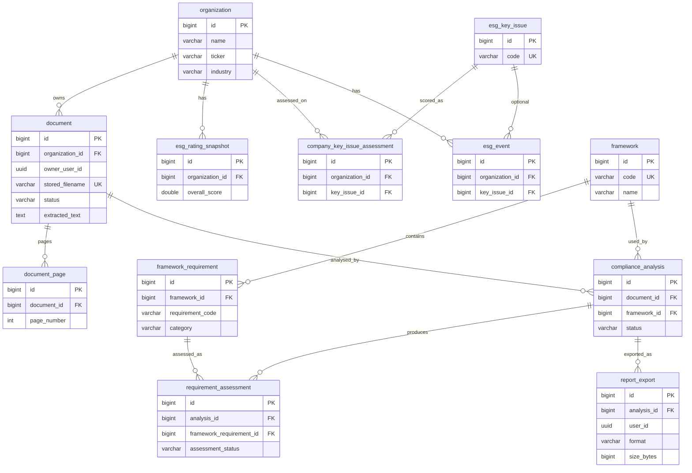

# Data model

Schema as migrated by Flyway scripts `V1`–`V11` under `backend/src/main/resources/db/migration/`. Migrations are written for PostgreSQL and H2 in PostgreSQL compatibility mode. JPA entities validate against this schema (`ddl-auto: validate`).

## Migration summary

| Version | Purpose |
| --- | --- |
| **V1** | Core tables: `organization`, `framework`, `framework_requirement` |
| **V2** | Seed demo org `ABC Industries Ltd.` |
| **V3** | Seed SEBI BRSR framework row |
| **V4** | Seed **14** prototype BRSR requirements (not the full official set) |
| **V5** | ESG comparison schema: extend `organization`; add rating / key-issue / event tables |
| **V6** | Seed listed IT companies + prototype ESG scores/events |
| **V7** | `document` upload metadata + extracted text |
| **V8** | `compliance_analysis`, `requirement_assessment` |
| **V9** | `document_page` for page-aware provenance |
| **V10** | `document.owner_user_id` — per-user ownership (`NULL` = shared sample visible to all signed-in users) |
| **V11** | `report_export` — gap-assessment PDF export history |

## Tables and columns

### `organization` (V1 + V5)

| Column | Type / notes |
| --- | --- |
| `id` | `BIGINT` identity PK |
| `name` | `VARCHAR(255)` NOT NULL |
| `cin` | `VARCHAR(50)` |
| `sector` | `VARCHAR(255)` |
| `created_at` | `TIMESTAMPTZ` NOT NULL default now |
| `ticker` | `VARCHAR(20)` (V5) |
| `industry` | `VARCHAR(255)` (V5) |

### `framework` (V1)

| Column | Type / notes |
| --- | --- |
| `id` | identity PK |
| `code` | `VARCHAR(20)` NOT NULL UNIQUE |
| `name` | `VARCHAR(100)` NOT NULL |
| `full_name` | `VARCHAR(255)` NOT NULL |
| `region` | `VARCHAR(100)` |
| `version` | `VARCHAR(50)` |
| `status` | `VARCHAR(20)` NOT NULL default `'ACTIVE'` |

Seed (V3): `BRSR` / SEBI BRSR / India / `BRSR 2023 (v1.2)`.

### `framework_requirement` (V1)

| Column | Type / notes |
| --- | --- |
| `id` | identity PK |
| `framework_id` | FK → `framework(id)` NOT NULL |
| `requirement_code` | `VARCHAR(20)` NOT NULL |
| `title` | `VARCHAR(255)` NOT NULL |
| `category` | `VARCHAR(20)` NOT NULL |
| `description` | `TEXT` |
| `framework_text` | `TEXT` |
| `mandatory` | `BOOLEAN` NOT NULL default TRUE |
| `version` | `VARCHAR(50)` |
| UNIQUE | `(framework_id, requirement_code)` |

Seed (V4): 14 codes `ENV-001`…`ENV-007`, `SOC-001`…`SOC-004`, `GOV-001`…`GOV-003`, version `MVP-2026`.

### `esg_rating_snapshot` (V5)

| Column | Type / notes |
| --- | --- |
| `id` | identity PK |
| `organization_id` | FK → `organization` NOT NULL |
| `overall_score`, `environmental_score`, `social_score`, `governance_score` | `DOUBLE PRECISION` NOT NULL |
| `rating_band` | `VARCHAR(10)` NOT NULL |
| `assessment_date` | `DATE` NOT NULL |
| `previous_overall_score` | `DOUBLE PRECISION` |
| `created_at` | `TIMESTAMPTZ` NOT NULL |
| Index | `(organization_id, assessment_date DESC)` |

### `esg_key_issue` (V5)

| Column | Type / notes |
| --- | --- |
| `id` | identity PK |
| `code` | `VARCHAR(100)` NOT NULL UNIQUE |
| `name` | `VARCHAR(255)` NOT NULL |
| `pillar` | `VARCHAR(20)` NOT NULL |
| `description` | `TEXT` |
| Index | `(pillar)` |

### `company_key_issue_assessment` (V5)

| Column | Type / notes |
| --- | --- |
| `id` | identity PK |
| `organization_id` | FK → `organization` NOT NULL |
| `key_issue_id` | FK → `esg_key_issue` NOT NULL |
| `score` | `DOUBLE PRECISION` NOT NULL |
| `risk_level` | `VARCHAR(20)` NOT NULL |
| `assessment_date` | `DATE` NOT NULL |
| Index | `(organization_id, assessment_date)` |

### `esg_event` (V5)

| Column | Type / notes |
| --- | --- |
| `id` | identity PK |
| `organization_id` | FK → `organization` NOT NULL |
| `title` | `VARCHAR(255)` NOT NULL |
| `description` | `TEXT` |
| `pillar` | `VARCHAR(20)` NOT NULL |
| `key_issue_id` | FK → `esg_key_issue` (nullable) |
| `severity` | `VARCHAR(20)` NOT NULL |
| `event_date` | `DATE` NOT NULL |
| `score_impact` | `DOUBLE PRECISION` |
| `source_name` | `VARCHAR(255)` |
| `source_url` | `TEXT` |
| `is_prototype` | `BOOLEAN` NOT NULL default TRUE |
| `created_at` | `TIMESTAMPTZ` NOT NULL |
| Indexes | `(organization_id, event_date DESC)`, `(severity)` |

### `document` (V7)

| Column | Type / notes |
| --- | --- |
| `id` | identity PK |
| `organization_id` | FK → `organization` NOT NULL |
| `original_filename` | `VARCHAR(255)` NOT NULL |
| `stored_filename` | `VARCHAR(255)` NOT NULL UNIQUE |
| `document_type` | `VARCHAR(50)` NOT NULL |
| `reporting_year` | `INTEGER` |
| `status` | `VARCHAR(20)` NOT NULL |
| `file_size` | `BIGINT` NOT NULL |
| `page_count` | `INTEGER` |
| `storage_path` | `VARCHAR(512)` NOT NULL |
| `extracted_text` | `TEXT` |
| `uploaded_at` | `TIMESTAMPTZ` NOT NULL |
| `processed_at` | `TIMESTAMPTZ` |
| `failure_reason` | `TEXT` |
| `owner_user_id` | `UUID` (V10), nullable — `NULL` = shared sample; non-null = uploader’s Supabase user id |
| Indexes | `organization_id`, `status`, `uploaded_at DESC`, `owner_user_id` (V10) |

PDF bytes live on the local filesystem (`stored_filename`); the DB holds metadata and text. Uploads from an authenticated user set `owner_user_id`; seed/shared rows keep `NULL`.

### `document_page` (V9)

| Column | Type / notes |
| --- | --- |
| `id` | identity PK |
| `document_id` | FK → `document(id)` ON DELETE CASCADE NOT NULL |
| `page_number` | `INTEGER` NOT NULL |
| `extracted_text` | `TEXT` |
| UNIQUE | `(document_id, page_number)` |
| Index | `document_id` |

### `compliance_analysis` (V8)

| Column | Type / notes |
| --- | --- |
| `id` | identity PK |
| `document_id` | FK → `document(id)` ON DELETE CASCADE NOT NULL |
| `framework_id` | FK → `framework(id)` NOT NULL |
| `status` | `VARCHAR(30)` NOT NULL (`IN_PROGRESS` / `COMPLETED` / `FAILED` in app) |
| `started_at` | `TIMESTAMPTZ` NOT NULL |
| `completed_at` | `TIMESTAMPTZ` |
| `failure_reason` | `TEXT` |
| Indexes | `document_id`, `framework_id`, `status` |

### `requirement_assessment` (V8)

| Column | Type / notes |
| --- | --- |
| `id` | identity PK |
| `analysis_id` | FK → `compliance_analysis(id)` ON DELETE CASCADE NOT NULL |
| `framework_requirement_id` | FK → `framework_requirement(id)` NOT NULL |
| `assessment_status` | `VARCHAR(30)` NOT NULL |
| `confidence` | `DOUBLE PRECISION` |
| `evidence_text` | `TEXT` |
| `evidence_chunks` | `TEXT` (JSON array of chunk DTOs) |
| `explanation`, `gap`, `recommendation` | `TEXT` |
| `retrieval_score` | `DOUBLE PRECISION` |
| `created_at` | `TIMESTAMPTZ` NOT NULL |
| UNIQUE | `(analysis_id, framework_requirement_id)` |
| Indexes | `analysis_id`, `framework_requirement_id` |

### `report_export` (V11)

| Column | Type / notes |
| --- | --- |
| `id` | identity PK |
| `analysis_id` | FK → `compliance_analysis(id)` ON DELETE CASCADE NOT NULL |
| `user_id` | `UUID`, nullable — exporter’s Supabase user id when known |
| `format` | `VARCHAR(20)` NOT NULL (app uses `PDF`) |
| `size_bytes` | `BIGINT` NOT NULL |
| `generated_at` | `TIMESTAMPTZ` NOT NULL default now |
| Index | `(user_id, generated_at DESC)` |

Rows are inserted when `GET /api/v1/analyses/{analysisId}/report.pdf` succeeds; listing is via `GET /api/v1/reports`.

## Entity-relationship diagram

## Seed / prototype notes

- V2 + V6 share one demo dataset (ABC Industries plus INFY / TCS / WPRO / HCLT). There is no per-user tenant table; V10 scopes **documents** by `owner_user_id` while organizations remain shared seed rows.
- V4 explicitly documents the 14-requirement BRSR MVP subset.
- V6 scores/events are illustrative prototype data (`is_prototype` default true on events).

## VERIFY

| Section | Primary sources |
| --- | --- |
| Tables / columns / FKs | `V1__create_core_esg_tables.sql` … `V11__create_report_export.sql` |
| Ownership semantics | `V10__add_document_owner_user_id.sql`; `Document.java`; `DocumentAccessPolicy.java` |
| Export history | `V11__create_report_export.sql`; `ReportExport.java`; `ReportExportService.java` |
| Seed semantics | `V2__seed_demo_organization.sql`; `V3__seed_brsr_framework.sql`; `V4__seed_brsr_requirements.sql`; `V6__seed_demo_companies_with_esg_data.sql` |
| App status enums (not DB CHECKs) | `AnalysisStatus.java`; `AssessmentStatus.java`; `DocumentStatus.java`; `DocumentType.java` |
| File vs DB storage | `LocalFileStorageService.java`; `DocumentService.java`; `application.yml` (`app.storage.upload-dir`) |
